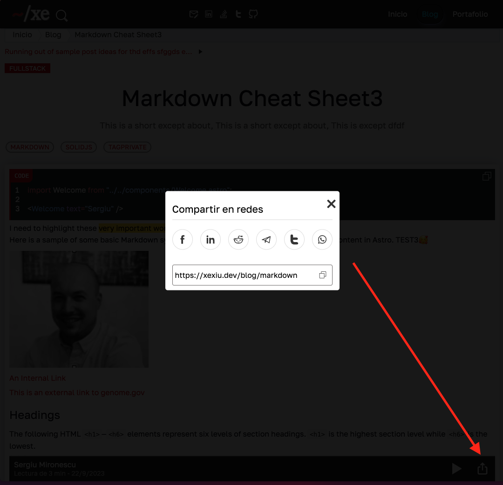

# `astro-modal`

## HELLO there 👋

- Twitter: <https://twitter.com/xexiudev> drop by and say hi, follow me and I follow you. Let's build a community.

> Pure HTML and CSS simple modal for astro. Uses API from browsers. Compatible with web/mobile, responsive, HTML5 semantic, SEO friendly. Lighthouse score 100%. No-Javascript
---
> Forking and giving a star will contribute to my motivation in making components for astro (react, react-native, etc...) that are purely HTML, CSS, SEO friendly and responsive :) (almost all components :P).

## Installation

- Using bun:

``` javascript
bun i @xexiu/astro-modal
```

- Using npm:

```javascript
npm i @xexiu/astro-modal
```

## API

- Props:

```javascript
export interface Props {
    id: string; // Required string
    ariaLabel: string; // Required string for good practices Lighthouse
    btnCloseAriaLabel: string; // Required string for good practices Lighthouse
    classes?: string; // Optional
    modalBtnClass?: string; // Optional
    headerClass?: string; // Optional
    sectionClass?: string; // Optional
    footerClass?: string; // Optional
    closeBtnClass?: string; // Optional
    btnText?: string; // Optional (if NOT Provided a close mark (X) will show on pop-up modal)
}

<header class:list={['modal-header', headerClass]}>
    <slot name="modal-title" />
</header>

<section class:list={['modal-section', sectionClass]}>
    <slot name="modal-main" />
</section>

<footer class:list={['modal-footer', footerClass]}>
    <slot name="modal-footer" />
</footer>
```

> Check code for more!

## Usage in astro

```javascript
---
// more personal/code imports
import Modal from '@xexiu/astro-modal';
---

<div>Whatever text/html</div>
<Modal id="__plainIdString__" ariaLabel="__labelString__" modalBtnClass="__bntClassString__" btnCloseAriaLabel="__labelString__">
    <SocialShareTitle slot="modal-title" {...props} />
    <SocialShareOptions slot="modal-main" {...props} />
    <SocialShareFooter slot="modal-footer" {...props} />
</Modal>
```

> If classes are NOT specified, the modal has default styles.
---
> Demo: <https://xexiu.dev/blog> (click an article and share it from the floating sidebar on bottom)
> Screenshot:


> This prodcut is actively mantained. Any PR, issues or whatever concern, please visit the Github repository <https://github.com/xexiu/astro-components>.

Chao pescao! 👋 🐠
