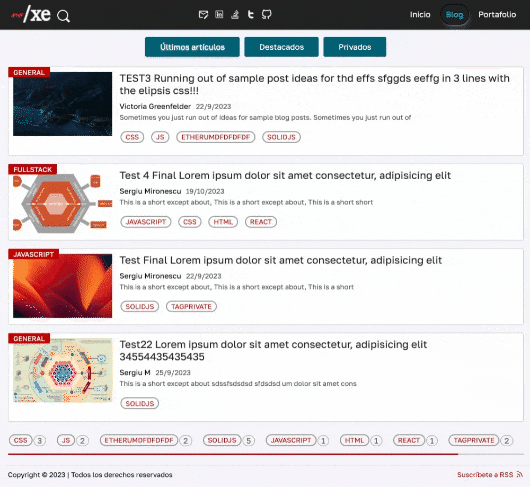

# astro-tabs

## HELLO there 👋

- Twitter: <https://twitter.com/xexiudev> drop by and say hi, follow me and I follow you. Let's build a community.

> Pure HTML and CSS simple dynamic tabs for astro. Uses API from browsers. Compatible with web/mobile, responsive, HTML5 semantic, SEO friendly. Lighthouse score 100%. No-Javascript
---
> Forking and giving a star will contribute to my motivation in making components for astro (react, react-native, etc...) that are purely HTML, CSS, SEO friendly and responsive :) (almost all components :P).

## Installation

- Using bun:

``` javascript
bun i @xexiu/astro-tabs
```

- Using npm:

```javascript
npm i @xexiu/astro-tabs
```

## API

- Props:

```javascript
export interface Props {
    tabTitles: string[]; // Required array
    keys: string[]; // Required array
    classes?: string; // Optional
    tabsNavClass?: string; // Optional
    panelsContainerClass?: string; // Optional
    panelClass?: string; // Optional
    tabTitleClasses?: string; // Optional
}
```

> Check code for more!

## Usage in astro

```javascript
const blogs = {
    latest: [{
        id: 1,
        title: "Test 1",
    }],
    pinned: [{
        id: 1,
        title: "Test 2",
    }],
    private: [{
        id: 1,
        title: "Test 3",
    }]
}
---
// more personal/code imports
import Tabs from '@xexiu/astro-tabs';

const keys = Object.keys(blogs); // ['latest', 'pinned', 'private']
---

<div>Whatever text/html</div>
<Tabs {keys} tabTitles={['Title for Latest', 'Title for Private', 'Title for Pinned']}>
    {
        (key: string) => {
            return (
                <Fragment>
                    <Posts entries={blogs[key]} /> // blog['latest'] and so on (map internally over keys)
                </Fragment>
            );
        }
    }
</Tabs>
```

> If classes are NOT specified, the tabs have default styles.
---
> Demo: <https://xexiu.dev/blog>
> Screenshot:


> This prodcut is actively mantained. Any PR, issues or whatever concern, please visit the Github repository <https://github.com/xexiu/astro-components>.

Chao pescao! 👋 🐠
